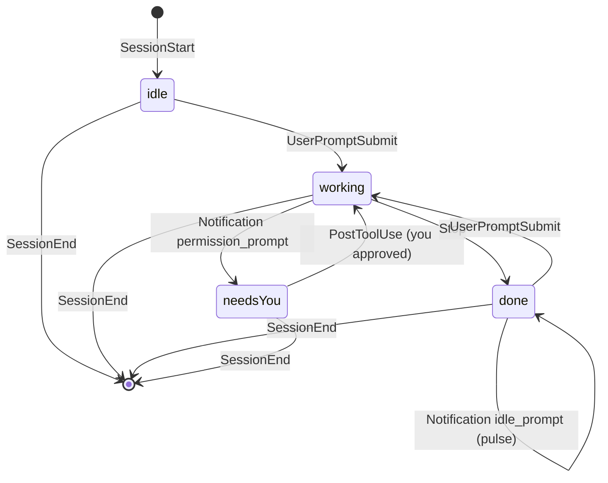

# Lightswitch Overhaul Plan

Sep 24, 2026 · @Connor

## Goal and scope

Lightswitch becomes a native macOS app: a notch overlay forked from boring.notch that shows one dot per running Claude Code session (up to 4), coloured by state, flashes when a session needs you, and keeps the ambient-light "hand over the notch" gesture as an input. Today Lightswitch is a 78-line C proof of concept with no UI; the overhaul turns it into an Xcode project with a Swift front end and moves the C sensor code into it.

**In scope**

- A notch window that sits over the physical notch, opens on hover, and closes on mouse-out (boring.notch core).
- Closed state: up to four dots in the notch, one per Claude Code session. Yellow = working, red = needs your input, green = finished and waiting, grey = idle.
- Open state: a list of sessions with project folder, state, and time since last change.
- A flash ("sneak peek") plus optional sound when a session turns red.
- A Claude Code hook script and a settings.json installer so every session reports its state automatically.
- The ambient light sensor gesture, ported from `lightswitch.c` to Swift, mapped to notch actions (open the notch, acknowledge the red dot).

**Out of scope for this pass**

- Music, calendar, battery, shelf, HUD replacement, webcam, and every other boring.notch feature. They get deleted, not disabled.
- App Store distribution. The app ships as a signed .app or DMG from GitHub.
- Windows/Linux, Claude Code sessions on remote machines, and Cowork sessions (they have no local hooks).

## Where Lightswitch is today

The repo at `~/lightswitch` is one commit (Aug 19, 2026) holding two C programs and a README. There is no app bundle, no Xcode project, no Swift, and no UI of any kind. Everything below is what the overhaul builds on.

| File | Lines | What it does | Fate in the overhaul |
| --- | --- | --- | --- |
| `lightswitch.c` | 78 | Reads the ambient light sensor (Vishay VD6286) through private IOKit HID calls loaded with `dlopen`/`dlsym`, calibrates a 2 s baseline, fires when lux drops below 45% for 2 consecutive reads, re-arms above 75%, sends Cmd-W with `--kill` | Ported to Swift as `LightSensor.swift`; the detection logic stays identical |
| `touchprobe.c` | 82 | Proves the Touch ID sensor (Mesa) is asleep unless an auth request is pending, so it cannot be a hover input | Moved to `tools/` and kept as a note; not used by the app |
| `README.md` | 22 | Build lines, measured numbers (4.7 Hz refresh, ±6 lux noise on \~4830 lux, \~400 ms latency), the auto-brightness caveat | Rewritten for the app; the measurements move into a Sensor notes section |
| `.gitignore` | 3 | Ignores the two binaries and `.DS_Store` | Replaced with an Xcode-style ignore |

**What already works and is worth keeping**

- The sensor read path: `IOHIDEventSystemClientCreate` → `IOHIDEventSystemClientCopyServices` → find the service that answers `IOHIDServiceClientCopyEvent(svc, 12, 0, 0)` → `IOHIDEventGetFloatValue(ev, (12 << 16) | 1)`. This is the only known way to read lux from user space and it is the hard part of the whole gesture.
- The hysteresis design: trigger at 45% of baseline, re-arm at 75%, slow drift tracking (`base = 0.995·base + 0.005·v`) while uncovered, 1 s refire lockout, refuse to run under 25 lux.
- The measured numbers in the README, which set the timing budget for the UI (the gesture cannot be faster than \~400 ms).

**What is missing**

- Any window, view, or persistent process. It is a terminal program that must be launched by hand.
- Any notion of Claude Code sessions.
- Settings, launch at login, signing, an icon.
- Tests. The C code is validated by running it and looking at stdout.

## boring.notch as the front-end base

boring.notch ([TheBoredTeam/boring.notch](https://github.com/TheBoredTeam/boring.notch), v2.7.3, \~19,300 lines of Swift in 118 files as of Sep 23, 2026) gives Lightswitch a proven notch window, shape, hover-to-open animation, multi-display handling, and a transient "sneak peek" mechanism. Roughly 1,200 lines of it are the core we keep; the rest is music, calendar, shelf, and HUD features that get deleted.

**License and toolchain**

- License is **GPL-3.0**. A fork must stay GPL-3.0, publish its source, and keep copyright headers. `THIRD_PARTY_LICENSES` also covers files copied into the tree: `NotchShape.swift` is MIT (from DynamicNotchKit) and `private/CGSSpace.swift` is MPL-2.0. See the decisions section if GPL is a problem.
- Deployment target is macOS 14.0 (`MACOSX_DEPLOYMENT_TARGET = 14.0` in `boringNotch.xcodeproj/project.pbxproj`). The README and CI say building needs **macOS 15.6+ and Xcode 26+**. Swift 5 mode with `SWIFT_STRICT_CONCURRENCY = targeted`.
- Build system is the Xcode project only, no `Package.swift`. Two targets: `boringNotch` (the app, `LSUIElement = YES`, sandboxed) and `BoringNotchXPCHelper` (brightness and accessibility calls outside the sandbox). We drop the helper target.

**Dependencies (all SPM unless noted)**

| Package | Used for | Keep? |
| --- | --- | --- |
| `Defaults` 9.x | Typed UserDefaults; every setting key lives in `models/Constants.swift` | Yes |
| `SkyLightWindow` | Shows the notch over the lock screen via a private SkyLight API | Optional; drop unless you want dots on the lock screen |
| `KeyboardShortcuts` | Global hotkeys | No |
| `Sparkle` 2.9 | Auto-update | No |
| `LaunchAtLogin-Modern` | Login item toggle in settings | Re-add later if wanted |
| `lottie-spm` | Music idle animation | No |
| `MacroVisionKit` | Fullscreen-space detection to hide the notch | No |
| `AsyncXPCConnection` | XPC helper client | No |
| `swiftui-introspect` | Used in ContentView, SettingsView, WelcomeView | No (remove the imports) |
| `Pow`, `swift-collections` | Declared, never imported | No |
| `mediaremote-adapter` framework + perl script (non-SPM) | Now Playing | No |

**How the core works (the pieces we keep)**

`boringNotchApp.swift` holds `@main struct DynamicNotchApp: App` with an `AppDelegate`. `applicationDidFinishLaunching` registers screen-change observers and calls `adjustWindowPosition(changeAlpha:)`, which creates one window per display (or one on the preferred display) through `createBoringNotchWindow(for:with:)`:

```swift
let rect = NSRect(x: 0, y: 0, width: windowSize.width, height: windowSize.height) // 640 x 210
let styleMask: NSWindow.StyleMask = [.borderless, .nonactivatingPanel, .utilityWindow, .hudWindow]
let window = BoringNotchSkyLightWindow(contentRect: rect, styleMask: styleMask, backing: .buffered, defer: false)
window.contentView = NSHostingView(rootView: ContentView().environmentObject(viewModel))
window.orderFrontRegardless()
NotchSpaceManager.shared.notchSpace.windows.insert(window)
```

The window class (`components/Notch/BoringNotchSkyLightWindow.swift`, an `NSPanel`) sets `isFloatingPanel = true`, `level = .mainMenu + 3`, `collectionBehavior = [.fullScreenAuxiliary, .stationary, .canJoinAllSpaces, .ignoresCycle]`, clear background, no shadow, and refuses to become key or main. `BoringNotchWindow.swift` is the same class without SkyLight and is what we use if we drop that dependency. `private/CGSSpace.swift` plus `managers/NotchSpaceManager.swift` put the panel in a private window-server space at max level so it floats above fullscreen apps and the menu bar.

Positioning is top-centre of the target screen. Notch size comes from `sizing/matters.swift` `getClosedNotchSize(screenUUID:)`: width = `screen.frame.width - auxiliaryTopLeftArea.width - auxiliaryTopRightArea.width + 4` (fallback 185), height = `safeAreaInsets.top` on notched Macs or the menu bar height otherwise. Constants: `openNotchSize = 640×190`, `windowSize = 640×210`, closed corner radii top 6 / bottom 14, open radii top 19 / bottom 24. Displays are keyed by UUID via `extensions/NSScreen+UUID.swift`.

State lives in two objects. `models/BoringViewModel.swift` is one per window and owns `@Published private(set) var notchState: NotchState` (`.closed` or `.open`, from `enums/generic.swift`), `notchSize`, `closedNotchSize`, `screenUUID`, and `open()`/`close()`. `BoringViewCoordinator.swift` is a `@MainActor` singleton owning the current tab, the preferred screen, and the two transient channels `sneakPeek` and `expandingView`, each auto-hidden by a cancellable `Task.sleep`.

`ContentView.swift` is the root view. Its body is a `ZStack(alignment: .top)` with a `VStack` whose `NotchLayout()` is padded, given a black background, clipped with `NotchShape`, and given a shadow; a transparent "chin" rectangle below enlarges the hover target. Animations are `Animation.spring(response: 0.42, dampingFraction: 0.8)` on open and `spring(response: 0.45, dampingFraction: 1.0)` on close, applied with `.animation(_, value: vm.notchState)`. Open content uses `.transition(.scale(scale: 0.8, anchor: .top).combined(with: .opacity))`. Hover is `.onHover` → a `Task` that sleeps `Defaults[.minimumHoverDuration]` (0.3 s) then calls `doOpen()`; mouse-out closes after a 100 ms debounce. `NotchShape.swift` is an animatable `Shape` with the flared "ears" at the top corners.

**The sneak-peek mechanism (what the red-dot flash reuses)**

`BoringViewCoordinator.toggleSneakPeek(status:type:duration:value:icon:)` sets `sneakPeek` inside `withAnimation(.smooth)` and schedules a hide after 1.5 s; `toggleExpandingView(status:type:value:browser:)` does the same for 3 s. While the notch is closed, `ContentView.NotchLayout()` renders these as content to the left and right of a black spacer of `closedNotchSize.width + 10`, so the black shape widens to 640 and shows text beside the notch. Note `toggleSneakPeek` early-returns for non-music types unless `Defaults[.hudReplacement]` is on; our fork removes that guard.

**Keep / delete list**

| Keep (trim to what is listed) | Approx. lines after trim |
| --- | --- |
| `boringNotchApp.swift` (strip Sparkle, onboarding, drag detectors, hotkeys, hello sound) | 250 |
| `ContentView.swift` (keep shape, hover, gesture, animation; delete music/battery/HUD/shelf branches) | 250 |
| `models/BoringViewModel.swift` (drop webcam, drop targets, `MusicManager.forceUpdate()`, `SharingStateManager`) | 100 |
| `BoringViewCoordinator.swift` (keep screen selection and the sneak-peek timers; delete HUD/XPC init) | 120 |
| `components/Notch/NotchShape.swift`, `BoringNotchWindow.swift`, `sizing/matters.swift`, `enums/generic.swift` | 300 |
| `private/CGSSpace.swift`, `managers/NotchSpaceManager.swift`, `extensions/NSScreen+UUID.swift`, `extensions/ConditionalModifier.swift`, `animations/drop.swift` | 200 |
| `models/Constants.swift` (only the keys we use), `components/Settings/SettingsWindowController.swift` + a new small `SettingsView` | 150 |
| `Assets.xcassets`, `Info.plist`, entitlements (remove camera, calendar, Apple Events) | n/a |

Delete outright: `MediaControllers/`, `mediaremote-adapter/`, `managers/{Music,Calendar,Battery,Volume,Brightness,Webcam,Image}*`, `components/{Shelf,Calendar,Music,Webcam,Onboarding,Tabs,Tips,Live activities}/`, `components/Notch/{NotchHomeView,BoringHeader,BoringExtrasMenu}.swift`, `observers/`, `XPCHelperClient/`, the `BoringNotchXPCHelper` target, `Providers/`, `Shortcuts/`, `helpers/`, `metal/`, `updater/`, `menu/StatusBarMenu.swift`, `animations/HelloAnimation.swift`, `models/{EventModel,PlaybackState,MusicControlButton,SharingStateManager,BatteryStatusViewModel,CalendarModel}.swift`, `boring.m4a`, and `Localizable.xcstrings`.

**Known compile traps after gutting**

- `Defaults.Keys.mediaController` in `Constants.swift` calls `MusicManager.shared` in its default value; delete the key.
- `BoringViewModel.close()` references `ShelfStateViewModel` and `SharingStateManager`; delete those lines.
- `ContentView` imports `SwiftUIIntrospect`; remove the import and the `.introspect` modifiers.
- `BoringHeader` draws a black `NotchShape` of `closedNotchSize.width` at the top centre of the open view to hide the physical notch. Our own header must do the same or the open notch shows a hole.

## Target architecture

The app is five modules with one-way data flow: Claude Code hooks write small JSON files, a watcher turns them into a published session list, and the notch views render that list. The light sensor is a second input that only produces gesture events. Nothing in the UI talks to Claude Code directly.

```mermaid
flowchart LR
  CC[Claude Code sessions<br/>1 to 4 terminals] -->|hooks run notch.sh| FS[~/.claude-notch/sessions/<br/>one JSON per session]
  FS -->|DispatchSource<br/>directory watch| SS[SessionStore<br/>@Published sessions]
  SS --> CV[ContentView<br/>closed: DotsRow<br/>open: SessionList]
  SS -->|red transition| SP[Coordinator sneak peek<br/>+ sound]
  ALS[LightSensor<br/>ALS via IOKit] -->|gesture| GA[GestureActions<br/>open / acknowledge]
  GA --> VM[BoringViewModel<br/>open / close]
  CV --> VM
  HI[HookInstaller] -->|writes once| CFG[~/.claude/settings.json<br/>~/.claude/hooks/notch.sh]
```

Hooks fire in the Claude Code process, write a file, and exit; the app reacts to the file. That keeps the app optional (sessions run fine if it is closed) and lets it rebuild state on launch by reading the folder.

**Proposed source layout (`Lightswitch/` inside the Xcode project)**

| Folder / file | Origin | Responsibility |
| --- | --- | --- |
| `App/LightswitchApp.swift`, `App/AppDelegate.swift` | boring.notch `boringNotchApp.swift`, split | `@main`, window creation per display, screen-change handling, menu bar extra with Settings and Quit |
| `Notch/NotchWindow.swift`, `Notch/NotchShape.swift`, `Notch/NotchSizing.swift`, `Notch/NotchSpace.swift`, `Notch/CGSSpace.swift` | boring.notch, renamed | The panel, the shape, size constants, the private space above fullscreen |
| `Notch/NotchViewModel.swift`, `Notch/NotchCoordinator.swift` | boring.notch `BoringViewModel` / `BoringViewCoordinator`, trimmed | Open/closed state per window; sneak-peek timer; preferred screen |
| `Notch/ContentView.swift` | boring.notch, trimmed | Root view: shape, hover, animation. Calls `DotsRow` when closed and `SessionListView` when open |
| `Sessions/Session.swift` | new | `struct Session: Identifiable, Codable` with `id`, `state`, `cwd`, `pid`, `tty`, `termProgram`, `updatedAt`, `slot` |
| `Sessions/SessionState.swift` | new | `enum SessionState: String, Codable { case idle, working, needsYou, done }` plus colour and label |
| `Sessions/SessionStore.swift` | new | Watches the folder, decodes files, assigns slots 1 to 4, prunes dead PIDs every 10 s, publishes `[Session]` and a `lastAlert` event |
| `Sessions/HookInstaller.swift` | new | Writes `notch.sh`, merges the hooks block into `~/.claude/settings.json` with a backup, reports status in Settings |
| `Views/DotsRow.swift` | new | Four fixed-width slots in the closed notch; a dot per session, pulsing when red |
| `Views/SessionListView.swift` | new | Open-state list: dot, folder name, state, time since update, click to focus terminal |
| `Views/AlertPeekView.swift` | new, patterned on boring.notch `InlineHUD` | The text shown beside the notch for 3 s when a session turns red |
| `Sensor/LightSensor.swift` | port of `lightswitch.c` | Reads lux on a background thread, calibrates, publishes `covered` / `uncovered` |
| `Sensor/GestureActions.swift` | new | Maps a cover gesture to open notch / acknowledge red / user-chosen action |
| `Terminal/TerminalFocuser.swift` | new | Activates the terminal app that owns a session (by `termProgram` and `tty`) |
| `Settings/SettingsView.swift`, `Settings/Keys.swift` | boring.notch pattern with `Defaults` | Show on all displays, hover-to-open, alert sound, sensor on/off, gesture action, hook status |
| `tools/lightswitch.c`, `tools/touchprobe.c` | existing | Kept as standalone probes |

**Threading and ownership**

- `SessionStore` and `NotchCoordinator` are `@MainActor` singletons. The `DispatchSource` callback hops to the main actor before publishing.
- `LightSensor` runs its 100 ms poll loop on its own `DispatchQueue`; it only publishes on the main actor.
- One `NotchViewModel` per display (boring.notch's existing dictionary keyed by screen UUID). All windows share the same `SessionStore`, so dots match on every screen.

**Sizing the closed notch for four dots**

The closed notch content area is `closedNotchSize.width - 20` wide (about 165 pt on a 14-inch MacBook Pro). Four 8 pt dots with 10 pt gaps need 62 pt, so they fit centred with room to spare. When a session turns red, the flash uses the sneak-peek path, which widens the black shape to 640 pt and shows the folder name and "needs you" beside the notch, then shrinks back after 3 s. No layout change is needed inside the notch itself.

## Claude Code integration

Every Claude Code session reports its state through hooks in `~/.claude/settings.json` that run one script, `~/.claude/hooks/notch.sh`. Each hook gets JSON on stdin with a stable `session_id`, and the script writes `~/.claude-notch/sessions/<session_id>.json`. Six events cover the whole lifecycle.

**State machine**



`PostToolUse` is the transition people forget: after you approve a permission prompt no `UserPromptSubmit` fires, so without it the dot stays red while Claude is working again. `Stop` fires at the end of every assistant turn, which is exactly "done, waiting for you".

| Hook event | Matcher | State written | Notes |
| --- | --- | --- | --- |
| `SessionStart` | `*` | `idle` | Also fires on `/resume` and `/clear`; same `session_id`, so the file is just rewritten |
| `UserPromptSubmit` | none (no matcher support) | `working` |  |
| `PostToolUse` | `*` | `working` | Fires often; the script skips the write when the state is unchanged |
| `Notification` | `permission_prompt` | `needsYou` | The `notification_type` field is missing from the stdin payload ([issue #11964](https://github.com/anthropics/claude-code/issues/11964)), so the matcher is the only reliable filter; pass the state as a script argument |
| `Notification` | `idle_prompt` | `done` with `idle: true` | Fires after Claude has waited about 60 s for you; the app pulses the green dot |
| `Stop` | none | `done` | Must exit 0; exit 2 blocks Claude from stopping |
| `SessionEnd` | `*` | file deleted | Not fired on a crash or `kill -9`; the app prunes by PID |

**The script, `~/.claude/hooks/notch.sh`**

```bash
#!/bin/bash
# usage: notch.sh <state>   state = idle|working|needs_you|done|idle_done|gone
state="$1"
input=$(cat)
sid=$(printf '%s' "$input" | jq -r .session_id)
cwd=$(printf '%s' "$input" | jq -r .cwd)
dir="$HOME/.claude-notch/sessions"
mkdir -p "$dir"
f="$dir/$sid.json"

if [ "$state" = "gone" ]; then rm -f "$f"; exit 0; fi

# The hook runs as a child of the claude process, so $PPID is claude's PID.
pid=$PPID
tty=$(ps -o tty= -p "$pid" 2>/dev/null | tr -d ' ')
idle=false
if [ "$state" = "idle_done" ]; then state=done; idle=true; fi

current=$(jq -r .state "$f" 2>/dev/null)
[ "$current" = "$state" ] && [ "$idle" = false ] && exit 0

jq -n --arg sid "$sid" --arg state "$state" --arg cwd "$cwd" \
      --argjson pid "$pid" --arg tty "$tty" --arg term "${TERM_PROGRAM:-}" \
      --argjson idle "$idle" --argjson ts "$(date +%s)" \
      '{session_id:$sid,state:$state,cwd:$cwd,pid:$pid,tty:$tty,term_program:$term,idle:$idle,updated_at:$ts}' \
  > "$f.tmp" && mv "$f.tmp" "$f"
exit 0
```

The write goes through `mv` so the app never reads a half-written file. `jq` is required; the installer checks for it and offers `brew install jq`. `$PPID` gives the PID of the `claude` process, which is what lets the app detect dead sessions and, later, focus the right terminal via `tty` and `TERM_PROGRAM`.

**The hooks block merged into `~/.claude/settings.json`**

```json
{
  "hooks": {
    "SessionStart":     [{ "matcher": "*", "hooks": [{ "type": "command", "command": "~/.claude/hooks/notch.sh idle",      "async": true, "timeout": 5 }] }],
    "UserPromptSubmit": [{ "hooks": [{ "type": "command", "command": "~/.claude/hooks/notch.sh working",   "async": true, "timeout": 5 }] }],
    "PostToolUse":      [{ "matcher": "*", "hooks": [{ "type": "command", "command": "~/.claude/hooks/notch.sh working",   "async": true, "timeout": 5 }] }],
    "Notification":     [
      { "matcher": "permission_prompt", "hooks": [{ "type": "command", "command": "~/.claude/hooks/notch.sh needs_you", "async": true, "timeout": 5 }] },
      { "matcher": "idle_prompt",       "hooks": [{ "type": "command", "command": "~/.claude/hooks/notch.sh idle_done", "async": true, "timeout": 5 }] }
    ],
    "Stop":             [{ "hooks": [{ "type": "command", "command": "~/.claude/hooks/notch.sh done",      "async": true, "timeout": 5 }] }],
    "SessionEnd":       [{ "matcher": "*", "hooks": [{ "type": "command", "command": "~/.claude/hooks/notch.sh gone",      "async": true, "timeout": 5 }] }]
  }
}
```

`"async": true` keeps every hook off Claude's critical path. `HookInstaller` must merge, not overwrite: decode the existing file with `JSONSerialization`, append our entries to each event array only if no existing entry's command contains `notch.sh`, write `settings.json.bak` first, then write the merged file. Uninstall removes exactly the entries whose command contains `notch.sh`.

**Session file format (`~/.claude-notch/sessions/<id>.json`)**

```json
{ "session_id": "7f1c…", "state": "needs_you", "cwd": "/Users/connortan/lightswitch",
  "pid": 48213, "tty": "ttys004", "term_program": "iTerm.app", "idle": false, "updated_at": 1758700000 }
```

**SessionStore rules**

- Watch the directory with `DispatchSource.makeFileSystemObjectSource(fileDescriptor:eventMask: [.write, .rename, .delete])`; on any event, re-read every `*.json` (there are at most a handful) and diff against the current list. Ignore `*.tmp`.
- Slot assignment: sessions get slots 1 to 4 in order of first appearance; a slot stays with its session until the file disappears. A fifth session is tracked but shown only in the open list, with a "+1" marker in the closed notch.
- Pruning: every 10 s call `kill(pid, 0)`; `ESRCH` means the process is gone, so delete the file. This covers crashes, `kill -9`, and closed terminal windows, none of which fire `SessionEnd`.
- Alerting: when a session's state changes to `needs_you`, publish `lastAlert = session`. The coordinator shows the peek for 3 s and plays the sound if enabled. Do not re-alert while it stays red.
- Acknowledge: the gesture or a click sets a per-session `acknowledged` flag in memory that stops the pulse; the dot stays red until the state actually changes.

**Edge cases**

- Two sessions in the same folder are two dots; the open list shows the folder name plus the last 4 characters of the session id to tell them apart.
- Subagents fire `SubagentStop`, not `Stop`, so they do not flip the dot; the parent session's own `Stop` does.
- Cowork and cloud sessions never run local hooks and will not appear. That is expected.
- If `~/.claude/settings.json` is invalid JSON, the installer refuses to touch it and shows the error in Settings.

## Step-by-step build plan

Seven phases, each ending in something that runs. Phase 1 is the slog (gutting boring.notch); everything after it is new code of 100 to 300 lines. Do them in order: the dots need the window, the hooks need the dots to be visible, and the sensor is independent so it goes last.

**Phase 0: Repo restructure (half a day)**

1. `git mv lightswitch.c tools/lightswitch.c` and `git mv touchprobe.c tools/touchprobe.c`; update the build lines in their headers.
2. Add `LICENSE` (GPL-3.0, required by the fork) and `THIRD_PARTY_LICENSES` copied from boring.notch, with the boring.notch copyright line kept.
3. Replace `.gitignore` with an Xcode one (`build/`, `DerivedData/`, `*.xcuserstate`, `xcuserdata/`, `.DS_Store`, `tools/lightswitch`, `tools/touchprobe`).
4. Create `Lightswitch.xcodeproj` at the repo root with a macOS App target named `Lightswitch`, SwiftUI lifecycle, bundle id `com.connortan.lightswitch`, deployment target macOS 14.0, `LSUIElement = YES` in Info.plist, App Sandbox **off** (the light sensor needs IOKit HID access that the sandbox blocks).

**Phase 1: Fork the boring.notch core and get an empty notch on screen (2 to 3 days)**

1. `git clone --depth 1 https://github.com/TheBoredTeam/boring.notch` next to the repo. Do not build it yet; the README says Xcode 26 on macOS 15.6 or newer, so confirm your Xcode version first.
2. Copy only the keep-list files from the boring.notch section into the folders from the architecture table, renaming `Boring*` types to `Notch*` (`BoringViewModel` → `NotchViewModel`, `BoringViewCoordinator` → `NotchCoordinator`, `BoringNotchWindow` → `NotchWindow`, `DynamicNotchApp` → `LightswitchApp`).
3. Add the `Defaults` package (`https://github.com/sindresorhus/Defaults`, 9.x) as the only SPM dependency. Skip `SkyLightWindow` and use `BoringNotchWindow.swift` as `NotchWindow.swift`.
4. Work through the compile errors in this order: delete the `mediaController` key in `Keys.swift`; delete the `ShelfStateViewModel` and `SharingStateManager` lines in `NotchViewModel.close()`; remove `import SwiftUIIntrospect` and the `.introspect` modifiers in `ContentView`; delete every `MusicManager`, `BatteryStatusViewModel`, `VolumeManager`, `BrightnessManager`, `WebcamManager`, `ShelfStateViewModel`, and `Defaults[.hudReplacement]` reference in `ContentView` and `AppDelegate`; delete `KeyboardShortcuts` handlers and the Sparkle `SPUStandardUpdaterController` in the app struct.
5. Reduce `ContentView.NotchLayout()` to: closed → a clear `Rectangle` of width `closedNotchSize.width - 20`; open → a `VStack` with a header row that draws the black `NotchShape` mask over the physical notch (copy the 6 lines from `BoringHeader`) and a placeholder `Text("sessions")`.
6. Keep `openNotchSize` at 640×190 for now. Build and run: the notch should open on hover after 0.3 s and close on mouse-out. Verify on the built-in display and on an external monitor (no physical notch, so `getClosedNotchSize` falls back to menu-bar height).
7. Commit. This is the base every later phase builds on.

**Phase 2: Session model, watcher, dots (1 to 2 days)**

1. Write `Session.swift` and `SessionState.swift`. Colours: `idle` = `.gray.opacity(0.5)`, `working` = `.yellow`, `needsYou` = `.red`, `done` = `.green`.
2. Write `SessionStore.swift`: create `~/.claude-notch/sessions` if missing, open it with `open(path, O_EVTONLY)`, attach a `DispatchSource.makeFileSystemObjectSource`, and on every event call `reload()`, which decodes each file with `JSONDecoder` (snake_case strategy), keeps slot assignments in a `[String: Int]`, and publishes `sessions` sorted by slot. Add the 10 s `kill(pid, 0)` prune timer.
3. Write `DotsRow.swift`: an `HStack(spacing: 10)` of four 8 pt `Circle`s; each slot shows its session's colour or nothing; a `needsYou` dot that is not acknowledged gets `.scaleEffect` pulsing via `.animation(.easeInOut(duration: 0.8).repeatForever(autoreverses: true))`.
4. Write `SessionListView.swift` for the open state: one row per session with the dot, `URL(fileURLWithPath: cwd).lastPathComponent`, the state label, and a relative time from `updated_at`. Shrink `openNotchSize` to about 420×(40 + 36 · rows) so the open notch is not a huge empty panel.
5. Wire both into `ContentView.NotchLayout()` and inject `SessionStore.shared` as an `@EnvironmentObject`.
6. Test without Claude Code by writing files by hand: `echo '{"session_id":"a","state":"working","cwd":"/tmp/x","pid":1,"tty":"","term_program":"","idle":false,"updated_at":0}' > ~/.claude-notch/sessions/a.json`. The dot must appear within 100 ms and vanish when the file is deleted. Use `pid: 1` (launchd) so pruning does not remove it.

**Phase 3: Hook script and installer (1 day)**

1. Add `notch.sh` from the integration section as a bundle resource. `HookInstaller.install()` copies it to `~/.claude/hooks/notch.sh`, `chmod 755`, then merges the hooks block into `~/.claude/settings.json` as described (backup first, append only when no existing command contains `notch.sh`).
2. `HookInstaller.status()` returns `.notInstalled`, `.installed`, or `.jqMissing` (`which jq` fails). Show it in Settings with Install and Uninstall buttons.
3. Run four real `claude` sessions in four terminal tabs. Watch the dots go grey → yellow → green. Ask one to run a command it needs permission for and confirm red, then yellow after approval. Quit one with `/exit` and confirm its dot leaves. `kill -9` another and confirm it leaves within 10 s.

**Phase 4: Attention flash and sound (half a day)**

1. Add a `SessionAlert` case to the coordinator's peek type and an `AlertPeekView` that shows the folder name on the left of the notch and "needs you" on the right, using the same widen-to-640 layout the battery peek used.
2. In `SessionStore`, when a state changes to `needsYou`, call `NotchCoordinator.shared.showAlert(session)` (3 s auto-hide) and, if `Defaults[.alertSound]`, `NSSound(named: "Glass")?.play()`.
3. `idle_prompt` (the `idle: true` flag on a `done` session) triggers a slower pulse on the green dot, no sound.

**Phase 5: Port the light sensor (1 day)**

1. `LightSensor.swift`: load the same five symbols with `dlopen("/System/Library/Frameworks/IOKit.framework/IOKit", RTLD_NOW)` and `dlsym`, cast with `unsafeBitCast` to `@convention(c)` function types. Find the ALS service exactly as `lightswitch.c` does (the first service that returns an event for type 12).
2. Move the calibration and hysteresis loop over verbatim: 2 s baseline, refuse under 25 lux, trigger at 45%, re-arm at 75%, two consecutive low reads, 1 s refire lockout, drift tracking at 0.5% per read. Poll every 100 ms on a background queue; publish `covered` and `uncovered` on the main actor.
3. `GestureActions`: on `covered`, if any session is red, acknowledge the oldest red one and focus its terminal (Phase 6); otherwise toggle the notch open, and close it on the next cover. Make the action a `Defaults` enum so the old Cmd-W kill switch can stay as an option.
4. Settings: sensor on/off, live lux readout, and a note reminding you to turn off automatic brightness (from the README).

**Phase 6: Click or gesture to focus the terminal, polish (1 to 2 days)**

1. `TerminalFocuser.focus(session)`: if `term_program` is `iTerm.app`, run AppleScript that iterates windows, tabs, and sessions and selects the one whose `tty` matches; if `Apple_Terminal`, the same over `tabs` with `tty of tab`; otherwise fall back to `NSWorkspace.shared.runningApplications` and activate the app whose bundle matches `term_program` (VS Code, Ghostty, Kitty). Needs Automation permission for iTerm and Terminal.
2. Click handling in `SessionListView` rows and on the dots themselves.
3. Menu bar extra with Settings, "Install hooks", and Quit. Launch at login via `SMAppService.mainApp.register()`, no third-party package needed.
4. App icon, a proper `README.md`, signing with your Developer ID, and a `Makefile` or `xcodebuild` line that produces a zipped `.app` for GitHub Releases. Notarize if you plan to share it.

## Testing and verification

Each phase has a pass condition you can check in under five minutes, and the session logic gets real unit tests because it is the part that will silently drift. The C code was only ever tested by eye; the Swift port should not be.

| Phase | Check | Pass when |
| --- | --- | --- |
| 1 | Hover the notch, move away, repeat 10 times; plug in an external display; open a fullscreen app | Opens after 0.3 s, closes on mouse-out, no flicker; a notch appears on the external display at menu-bar height; the notch still floats above the fullscreen app |
| 2 | Write, edit, and delete session files by hand (`pid: 1`) | Dot appears or changes within 100 ms; deleting the file removes the dot; slots keep their order when a middle session leaves |
| 2 | Write a file with `pid: 999999` | Dot disappears within 10 s (prune) |
| 3 | Four real `claude` sessions; one permission prompt; one `/exit`; one `kill -9` | Colours follow the state machine exactly; `/exit` removes the dot at once; `kill -9` removes it within 10 s |
| 3 | `cat ~/.claude/settings.json.bak` and diff against the merged file | Only `hooks` entries containing `notch.sh` were added; every existing key survived |
| 4 | Trigger a permission prompt in a background session while working in another | Flash beside the notch for 3 s, sound plays once, dot pulses until acknowledged |
| 5 | Run the app in a lit room, cup a hand over the notch for 1 s, remove, repeat | Gesture fires once per cover, no double fires, re-arms on uncover; refuses to arm under 25 lux with a Settings message |
| 6 | Click a red dot with iTerm, Terminal, and VS Code sessions | The right tab comes to the front for iTerm and Terminal; the app activates for VS Code |

**Unit tests (XCTest target `LightswitchTests`)**

- `SessionStoreTests`: decode a fixture file; slot assignment for add, remove, re-add; a fifth session does not take a slot; `needsYou` transition publishes exactly one alert; `acknowledged` resets when the state changes.
- `HookInstallerTests`: merging into an empty file, into a file with unrelated hooks, and into a file that already has `notch.sh` entries (idempotent); uninstall leaves unrelated hooks untouched; invalid JSON is refused and the original is unchanged.
- `LightSensorLogicTests`: pull the threshold logic into a pure `GestureDetector` struct that takes lux samples and returns events, then feed it recorded traces: a clean cover, flicker at the threshold, a slow dimming room (drift tracking must not fire), and a cover held for 5 s (fires once).

**Manual soak**

Run the app for a full working day with hooks installed before calling Phase 3 done. The two things most likely to show up only over hours are a stale dot from a session that died without `SessionEnd` and a hook that ran when `jq` was not on `PATH` (Claude Code launched from an app rather than a shell). For the second, the script should use `/opt/homebrew/bin/jq` as a fallback when `jq` is not found.

**Recording the results**

Add a `docs/testing.md` with the table above and a date next to each row when it last passed, so a later change to boring.notch upstream or to Claude Code hooks has a checklist to re-run.

## Risks, open questions, and decisions

The two decisions that change the plan are the license and the sandbox; everything else is a risk with a workaround already in the phases above.

**Decisions for you**

- [ ] **GPL-3.0 or not.** Forking boring.notch makes Lightswitch GPL-3.0 and obliges you to publish source. Fine for a portfolio project on GitHub. If you ever want to keep it closed or sell it, the alternative is to skip the fork and depend on [DynamicNotchKit](https://github.com/MrKai77/DynamicNotchKit) (MIT), the library boring.notch's `NotchShape` came from; it gives you the notch window and open/close animation in about 30 lines of your own code but with less control over the shape and hover behaviour. The plan assumes the fork.
- [ ] **App Sandbox off.** `lightswitch.c` reads the sensor through `IOHIDEventSystemClient`, which the sandbox blocks. boring.notch is sandboxed and pushes such calls into an XPC helper. Turning the sandbox off is the simple path and costs nothing outside the App Store. Confirm you are fine with that.
- [ ] **What the gesture does.** The plan maps cover → acknowledge the red dot if any, else toggle the notch, with the old Cmd-W kill as a Settings option. Pick before Phase 5.
- [ ] **Which terminal you use** (iTerm, Terminal, VS Code, Ghostty). Phase 6 focus logic is written per terminal; start with yours.
- [ ] **All displays or built-in only.** boring.notch supports both; the dots are the same on every screen, so "all displays" is the more useful default if you use a monitor.
- [ ] **Lock screen dots.** Only matters if you keep `SkyLightWindow`. The plan drops it.

**Risks**

| Risk | Likelihood | Mitigation |
| --- | --- | --- |
| Your Xcode is older than 26 and the copied files use newer APIs | Medium | Check `xcodebuild -version` before Phase 1. The kept core is plain AppKit/SwiftUI targeting macOS 14, so most of it will compile on Xcode 16; fix what does not rather than upgrading mid-project |
| Private CGS space calls in `CGSSpace.swift` break on a macOS update | Low per year, certain eventually | Keep the `NotchWindow` level at `.mainMenu + 3` as a fallback; the app still works, it just stops floating above fullscreen apps |
| Private IOKit HID calls for the sensor stop working | Low | The sensor is an optional input; the app degrades to hover and click |
| Claude Code changes hook names or payloads | Medium over a year | All hook logic is in one 40-line script and one installer; the `notification_type` field is already missing today, which is why the matcher carries the state |
| `jq` not installed or not on `PATH` in GUI-launched terminals | Medium | Installer checks for it; script falls back to `/opt/homebrew/bin/jq` |
| Automatic brightness dims the screen when you cover the sensor | Certain if left on | Settings page repeats the README instruction; the app can detect the dimming as a lux drop that never reaches 45% and warn |
| The 4.7 Hz sensor refresh makes the gesture feel laggy next to hover | Certain | Accept \~400 ms; the gesture is for acknowledging, not for fast navigation |
| `PostToolUse` fires many times a second during long tool runs | Certain | The script skips unchanged writes; the watcher coalesces events and re-reads a handful of files |
| Two apps (boring.notch and Lightswitch) both drawing a notch | Only if you keep boring.notch installed | Quit boring.notch; both use the same window level and would overlap |

**Open questions**

- Does `$PPID` inside an async hook resolve to the `claude` process on your setup? Confirm in Phase 3 with `ps -p $PPID -o comm=` written to a log line; if hooks are spawned through an intermediate shell, walk one level up with `ps -o ppid= -p $PPID`.
- Does `Notification` with matcher `idle_prompt` fire while the session is in `done`, or only from `working`? Either way the state written is `done`, so the dot is right; only the pulse timing changes.
- How wide is the closed notch content area on your MacBook? `closedNotchSize.width - 20` is about 165 pt on a 14-inch; four dots fit either way, but the flash layout in Phase 4 should be checked on your screen.

**Sources**

- [boring.notch repository](https://github.com/TheBoredTeam/boring.notch) (cloned at HEAD `eac62ac`, v2.7.3)
- [Claude Code hooks reference](https://code.claude.com/docs/en/hooks)
- [Claude Code issue #11964: Notification hook missing notification_type](https://github.com/anthropics/claude-code/issues/11964)
- [DynamicNotchKit](https://github.com/MrKai77/DynamicNotchKit)
- `~/lightswitch` on your Mac, commit `c8f54ac`

## Implementation log (Sep 24, 2026)

Built in one pass as the initial stage. Every phase has something that runs;
the checks that need a person at the Mac are listed as pending in
`docs/testing.md`. Where the build departs from the plan above, this is why.

- **No boring.notch fork; the repo stays MIT.** The kept core would have been
  about 1,200 GPL lines of glue plus two permissively licensed files. Writing
  the window, shape, sizing and hover directly was less work than gutting
  19,000 lines, keeps every line understood, and avoids relicensing a
  portfolio project. The private window-server space is resolved with `dlsym`
  at runtime, so a missing symbol degrades to the AppKit window level instead
  of failing to launch.
- **Swift Package, not an Xcode project.** `Package.swift` builds three
  targets (the C engine as `CLightswitch`, `LightswitchKit`, the app) with
  `swift build` and `swift test`; `make app` wraps the release binary as a
  bundle with a generated icon. `open Package.swift` gives the Xcode
  experience. No third-party dependencies, including `Defaults`.
- **The sensor is not ported, it is linked.** `SensorEngine` wraps the C
  detector in switch mode, so the app's gesture is the same code the CLI and
  the 304 fixture assertions exercise. The "GestureDetector struct" tests in
  the plan are therefore the existing C suite plus replay tests through the
  bridge.
- **Dots live in a wing beside the notch, not inside it.** The notch has no
  pixels; content drawn "inside" the closed shape is invisible on a notched
  Mac. The wing grows to the right only, so it never covers an app's menu
  titles. The window is centred on the notch itself, which on this 14-inch is
  1.5 pt off the screen's centre.
- **Hooks need nothing installed.** `notch.sh` uses `jq` when present and
  `plutil` otherwise. `SessionStart` matches `startup|resume|clear|fork`
  rather than `*`, because it also fires on `compact` and would flip a working
  dot to grey mid-turn. `SessionEnd` runs synchronously (2 s) so it lands
  before the `SessionStart` that `/clear` fires for the same id.
  `elicitation_dialog` was added to the red matchers so questions count as
  "needs you". jq's `//` treats `false` as absent; the script avoids it.
- **The screen was locked during the build.** Window geometry and every
  layout were verified with offscreen renders (`LIGHTSWITCH_SNAPSHOT_DIR`);
  hover, the live sensor (the ALS disappears while the display sleeps; both
  the app and the CLI report "no ambient light sensor") and terminal focus
  are the manual checks still open. Hooks were not installed into the real
  `~/.claude/settings.json`; that is one click in the app.
